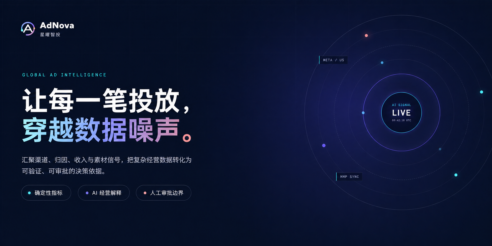
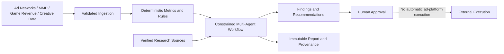

# AdNova · AI-Assisted Growth Intelligence for Game Advertising

<p align="center"><a href="README.md">简体中文</a> · <strong>English</strong></p>

<p align="center">
  
</p>

<p align="center"><strong>Turn fragmented user-acquisition data into verifiable, explainable, and approval-ready growth decisions.</strong></p>

<p align="center">
  
  
  
  
</p>

AdNova is an open-source advertising growth intelligence platform for global game publishing and user-acquisition teams. It unifies data from ad networks, mobile measurement partners, game revenue systems, and creative-performance pipelines. Deterministic code calculates business metrics; constrained AI agents explain the evidence, propose actions, and create approval requests.

The current release completes **Stage 14: Scheduled Research Discovery**. Administrators and managers can configure tenant-scoped public-web research jobs for a game or campaign. A durable worker executes them with database leases, while every discovered source still enters a human-review queue before it can influence analysis.

Current version: **1.4.1** · Latest iteration: **DEV-20260810-002** · See the [iteration history](docs/iterations/README.md) and [changelog](docs/releases/CHANGELOG.md).

## Why AdNova

Most advertising dashboards either stop at visualization or hand too much authority to an opaque model. AdNova deliberately separates calculation, interpretation, approval, and execution:

- **Numbers remain deterministic.** ROAS, CPI, payer rate, attribution gaps, and creative-fatigue signals are calculated by testable code, never by an LLM.
- **AI remains constrained.** Agents can only call registered tools. They cannot access the database, shell, arbitrary URLs, or advertising accounts directly.
- **Recommendations remain reviewable.** High-risk recommendations enter an explicit approval state machine with RBAC and audit history.
- **External research remains governed.** Web discoveries are stored as `PENDING` sources and require human verification before entering an analysis context.
- **Asynchronous work remains recoverable.** Transactional outboxes, idempotency keys, heartbeats, database leases, and fencing tokens protect long-running workflows from duplicate delivery and worker failure.
- **The demo is honest.** Mock providers make the complete workflow reproducible without pretending that unavailable external integrations are live.

## Safety Boundaries

- AdNova generates recommendations and approval requests; it does **not** change ad budgets, bids, campaign status, or creatives.
- Critical business metrics are calculated by deterministic code. The LLM does not perform authoritative arithmetic.
- Agents can call registered tools only; they do not receive direct database, shell, or unrestricted HTTP access.
- The project is a modular Go monolith, not a collection of premature microservices.
- AppsFlyer Raw Data Pull and Adjust Report Service integrations are read-only.
- Meta, Google Ads, and TikTok native pull APIs are not yet integrated. AdNova contains no advertising-platform write API.
- `APPROVED` means that a human accepted a recommendation; it does not mean that the recommendation was executed externally.

## What Is Included

- Multi-tenant-ready identity boundaries, JWT authentication, RBAC, company-email registration, verification, and administrator approval.
- Game, channel, campaign, and creative catalogs.
- JSON/CSV imports plus a versioned HTTP/Kafka ingestion contract.
- Deterministic metrics, trend analysis, configurable business rules, attribution comparison, and creative-fatigue analysis.
- Seven-agent workflow orchestration with persisted steps, SSE progress, internal notifications, and OpenClaw commands.
- Structured mock and OpenAI-compatible LLM adapters with schema validation, retries, safe error classification, and usage records.
- Recommendations, approval workflows, immutable report snapshots, provenance, audit logs, and operational dashboards.
- Read-only AppsFlyer and Adjust connectors with authoritative range replacement, sync history, provider-specific limits, and scheduled reconciliation.
- Brave Search-based live research, source registration, human verification, scheduled discovery, deduplication, and query-hash provenance.
- Production guardrails that reject demo credentials and demo seeding in production mode.

## Architecture at a Glance



The core ownership boundaries are intentionally separate:

- ingestion validates, normalizes, and deduplicates facts;
- metrics and rules produce authoritative calculations;
- agents interpret registered evidence through restricted tools;
- workflows own orchestration state and recovery;
- approvals own human decisions;
- reports and audit logs preserve provenance.

See [Architecture](docs/architecture.md), [API documentation](docs/api.md), and the [versioned OpenAPI contract](docs/contracts/api-contract.yaml).

## Technology Stack

- Backend: Go 1.24+, Gin, GORM, MySQL 8, Redis, Asynq, optional Kafka via franz-go, JWT, Zap, and Viper
- Frontend: Vue 3, TypeScript, Vite, Pinia, Vue Router, Element Plus, Axios, and ECharts
- Runtime: Docker Compose with API, worker, optional Kafka ingestion worker, web, MySQL, and Redis services
- Testing: Go testing, testify, Vitest, type checking, production builds, migration archive verification, and end-to-end scripts

## Quick Start

Docker and Docker Compose are required. The first startup builds the images, starts MySQL and Redis, applies versioned migrations, and idempotently creates the local demo identities.

```bash
cp .env.example .env
# The example values are suitable for local development only.
# Replace JWT_SECRET and database passwords before any shared deployment.
./scripts/start.sh
```

Open <http://localhost:5173>. The API health endpoint is <http://localhost:8080/health>.

Stop the stack with:

```bash
docker compose down
```

## Demo Accounts

All local demo accounts use the password `Demo@123456`.

| Username | Role |
|---|---|
| `admin` | `ADMIN` |
| `manager` | `MANAGER` |
| `operator` | `OPERATOR` |

These credentials are for local demonstrations only. Disable demo seeding or replace every credential before using a shared, test, or production environment. Production deployments must use random database passwords and a unique `JWT_SECRET`.

AdNova currently operates in single-company mode, so users do not choose a tenant at login. JWTs and database records still preserve `tenant_id` as a security boundary and future extension point.

## Run the Demo Workflow

After the Compose stack is ready, generate and import 30 days of representative data:

```bash
./scripts/import_demo.sh
```

The script is idempotent. It recalculates metrics, executes three analysis categories, and submits one asynchronous mock Business Agent task for the Meta sample. The dataset contains an anomalous Meta campaign, a normal Google control, a scaling TikTok campaign, AppsFlyer attribution, game revenue, and creative-performance records.

The default `LLM_PROVIDER=mock` mode demonstrates the full workflow without external model access. Real models share the OpenAI-compatible Chat Completions protocol. `openai` and `deepseek` use their official BaseURLs by default, while `openai-compatible` and `custom` support any compatible endpoint. An explicit BaseURL can override the default for every real provider:

```bash
# OpenAI
LLM_PROVIDER=openai
LLM_API_KEY=...
LLM_MODEL=<openai-model-id>

# DeepSeek
LLM_PROVIDER=deepseek
LLM_API_KEY=...
LLM_MODEL=<deepseek-model-id>

# Another compatible service or private gateway
LLM_PROVIDER=custom
LLM_BASE_URL=https://your-compatible-endpoint.example/v1
LLM_API_KEY=...
LLM_MODEL=<model-id>

# Per-agent switches (effective with a real provider)
LLM_RESEARCH_ENABLED=true
LLM_CREATIVE_ENABLED=true
LLM_OPENCLAW_ENABLED=true
LLM_REPORT_ENABLED=false
```

The client supports structured JSON outputs, timeouts, bounded retries, normalized token usage, and safe error categories. API keys and complete sensitive prompts are not logged. Custom BaseURLs must be absolute HTTP(S) URLs without embedded credentials, query parameters, or fragments.

Research, Creative, and OpenClaw enable LLM enhancement by default once a real provider is configured. Report summary polishing remains opt-in. Research can synthesize only human-verified sources, Creative can explain only deterministic findings, and Report can rewrite only the summary while preserving the source digest. Provider or semantic-validation failures fall back to deterministic output. Data and Attribution remain fully deterministic. Creative currently receives structured performance data, not image or video assets, so multimodal understanding is not claimed.

## Real Data and Integrations

### Standard HTTP and Kafka ingestion

Third-party producers use the [standard batch JSON Schema](configs/schemas/standard-ingestion-batch-v1.0.0.json). The same payload can be submitted to `POST /api/v1/imports/batches` or sent to a configured Kafka topic. A complete example is available at [standard_mmp_batch.json](examples/generated/standard_mmp_batch.json).

Start the optional Kafka ingestion worker with:

```bash
docker compose --profile kafka up -d --build
```

Compose does not bundle a Kafka broker. The consumer uses a MySQL inbox, manual offset commits, a DLQ, and idempotent business processing for at-least-once delivery. Successful batches merge analysis windows and trigger deterministic analysis after a debounce period.

### Read-only MMP synchronization

AppsFlyer uses the server-side `GAI_APPSFLYER_API_TOKEN`. Adjust uses `GAI_ADJUST_API_TOKEN` plus event metric slugs for activations, payers, and revenue. The frontend and database store only whether credentials are configured and the game-to-app mapping; API tokens are never returned or persisted.

Manual sync ranges are limited by provider. When `GAI_MMP_AUTO_SYNC_ENABLED=true`, the worker scans ready connections and performs rolling lookback reconciliation to absorb delayed attribution updates.

### Governed web research

The optional Brave Search integration retrieves public-web research in real time. Search results are ephemeral by default. Before storing results or enabling scheduled discovery, confirm that your selected provider plan permits result storage, then configure:

```bash
GAI_WEB_SEARCH_API_KEY=...
GAI_WEB_SEARCH_IMPORT_ENABLED=true
GAI_RESEARCH_SCHEDULER_ENABLED=true
GAI_RESEARCH_SCHEDULER_POLL_INTERVAL=1m
GAI_RESEARCH_SCHEDULER_LEASE=2m
```

Manual imports and scheduled discoveries both create `PENDING` sources. Only an `ADMIN` or `MANAGER` can verify a source, and only verified sources can enter an agent's analysis context. Scheduled runs store provider, query hash, counts, and safe errors—not raw result payloads or credentials.

For a clean production onboarding path, disable demo seeding and use the image's `bootstrap-admin` command to initialize the company, standard roles, system identity, and first administrator. See [Real Data Onboarding](docs/real-data-onboarding.md) for the credential checklist and acceptance criteria.

## Development and Verification

The backend requires MySQL and Redis for storage-backed paths. Unit tests that do not require external storage can run directly:

```bash
go test ./...
cd web
npm install
npm run dev
```

Run the repository's complete release gate with:

```bash
./scripts/test.sh
```

This runs Go formatting, vet, and tests; Vue type checking and Vitest; the production frontend build; migration pairing checks; and immutable contract/archive verification.

## Repository Layout

```text
cmd/server/              HTTP API entry point
cmd/worker/              Asynq worker, outbox dispatcher, MMP and research schedulers
cmd/ingestion-worker/    Kafka ingestion and analysis-window dispatcher
internal/auth/           Authentication, registration, email verification, and member approval
internal/ingestion/      Validation, normalization, deduplication, and standard batches
internal/metrics/        Deterministic calculations, aggregation, and trends
internal/rules/          Configurable rules and business-risk findings
internal/attribution/    Ad network, MMP, and game-revenue comparisons
internal/agent/          Agent specs, execution contracts, tasks, and restricted tool registry
internal/agents/         Runtime adapters for the seven agents
internal/workflow/       Persisted multi-agent workflow orchestration
internal/research/       Web discovery, source governance, scheduling, and verified evidence
internal/mmp/            AppsFlyer/Adjust connectors and synchronization
internal/business/       Business Agent validation, findings, and recommendations
internal/approval/       Approval state machine and permission policy
internal/report/         Deterministic reports and provenance
internal/audit/          Tool-call and human-decision audit trails
configs/prompts/         Immutable, semantically versioned prompts
configs/schemas/         Versioned agent and ingestion JSON Schemas
migrations/              Reviewable up/down SQL migrations
examples/generated/      Reproducible JSON and CSV demo datasets
web/                     Vue 3 application
docs/                    Architecture, API, ADRs, contracts, iterations, and releases
scripts/                 Startup, demo import, test, and verification scripts
```

## Current Status and Roadmap

Completed through Stage 14:

- deterministic data, metrics, rules, attribution, and creative analysis;
- constrained multi-agent workflows, asynchronous recovery, approvals, reports, and auditability;
- standard HTTP/Kafka ingestion;
- enterprise member registration and approval;
- read-only AppsFlyer and Adjust synchronization;
- governed live research and durable scheduled discovery.

Not yet completed:

- enterprise SSO/SCIM, invitation-based registration, password recovery, and administrator-forced session revocation;
- production credential validation against real Kafka, MMP, and Brave Search accounts;
- native read-only Meta, Google Ads, and TikTok connectors;
- external email/IM/webhook delivery;
- tamper-resistant production audit storage;
- cross-process OpenTelemetry and production model validation.

## Contributing

AdNova is licensed under the [MIT License](LICENSE). Issues and pull requests are welcome. Please read [CONTRIBUTING.md](CONTRIBUTING.md) before submitting changes.

The project follows a lightweight Git Flow model: feature branches target `develop`; releases flow from `develop` to `main`. Keep changes focused, add tests for new behavior, and run `./scripts/test.sh` before opening a pull request.

## Security

Do not commit `.env` files, real API tokens, database dumps, customer data, or private certificates. Report security vulnerabilities privately according to [SECURITY.md](SECURITY.md); do not disclose exploit details in a public issue.

## Open-Source Evaluation Notes

For reviewers evaluating AdNova as an open-source project, the repository intentionally includes more than a product demo:

- versioned SQL migrations with up/down paths and recorded checksums;
- immutable API, prompt, and schema contracts;
- append-only iteration and release records;
- deterministic demo data and idempotent import scripts;
- explicit failure, retry, lease, and fencing semantics;
- documented security boundaries and honest integration status;
- a complete local workflow that runs without paid external services.

The design goal is not to claim that AI can autonomously operate advertising accounts. It is to show how AI can participate safely in a measurable, reviewable, and reproducible growth-operations workflow.
